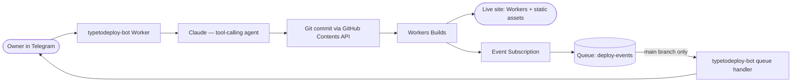

# TypeToDeploy

A company portfolio site (for Taras & Lisa — coaching, mountain guiding, snowboarding) whose content you edit by chatting with a Telegram bot. The bot hands your message to Claude as a tool-calling agent, which turns it into a validated content change, commits it straight to git, and the site redeploys automatically on Cloudflare Workers Builds. No CMS login, no build step to run by hand — just a text message.

<!-- TODO: add screenshot at docs/screenshot.png -->

<!-- TODO: this GIF doesn't exist yet — record a short screen capture of a Telegram edit landing on the live site and save it to docs/demo.gif -->


## Architecture

Two flows share the same trigger point: a git commit kicks off Workers Builds, which both deploys the site and fires the deploy-notification path.



**Content edit flow:** Telegram → the bot Worker → Claude (given two tools, `read_content_file` and `update_content_file`, backed by Zod schemas) → a commit via the GitHub Contents API → Workers Builds → the live site.

**Notification flow:** Workers Builds emits a build event through an Event Subscription onto a Cloudflare Queue (`deploy-events`); the same bot Worker consumes it with a `queue()` handler, filters out anything that isn't the `main` branch (Cloudflare creates its own branches, like `cloudflare/workers-autoconfig`, that shouldn't page anyone), and sends a Telegram message on success or failure.

## Why these decisions

**Content lives in git, not a database.** Every edit the bot makes is an ordinary commit — reviewable in a diff, with full history, and revertible with plain git mechanics. `/undo` doesn't need its own undo log; it just finds the last commit the bot made and reverts it. There's no separate datastore to keep in sync with what the site actually builds from.

**Cloudflare Workers with static assets, built by Workers Builds, instead of classic Pages or Vercel.** The bot was already a Cloudflare Worker, so keeping the site on the same platform means one dashboard, one place to reason about deploys, and — as it turned out — direct access to Workers Builds' event data instead of scraping a third-party host's deploy hooks.

**Event Subscriptions + a Queue instead of a webhook for deploy notifications.** I originally built a webhook endpoint assuming Cloudflare Pages' notification webhooks would fire for this site. They don't — this site was never on classic Pages, so that product's notifications simply don't apply here. Workers Builds' Event Subscriptions give structured, typed event data straight onto a queue instead, with no webhook payload to guess at and no email to parse.

**Direct Anthropic SDK tool-calling instead of a framework like LangChain.** The agent has exactly two tools and a bounded iteration cap — a hand-rolled loop over `@anthropic-ai/sdk`'s tool-use API is small enough to read start to finish and debug by tracing actual code, which mattered more than once when tracking down a real incident (a schema that silently stripped an unknown field) than it would have if that logic lived inside a framework.

## Tech stack

**Bot** (`bot/`, Cloudflare Worker, TypeScript):
- [grammY](https://grammy.dev/) — Telegram Bot API framework
- `@anthropic-ai/sdk` — Claude tool-calling (model: `claude-sonnet-5`)
- `zod` — strict schema validation for every content file before it's committed
- `postal-mime` — MIME parsing for an earlier, now-dormant email-based notification path
- Cloudflare KV — short-term conversation memory per chat
- Cloudflare Queues — consumes the `deploy-events` queue
- Workers Logs — structured JSON logging via a small `logEvent` helper
- `wrangler` — dev server and deploys

**Site** (`site/`, Astro):
- [Astro](https://astro.build/) with Content Collections — three JSON files (`site`, `services`, `portfolio`) are the entire source of truth for copy; nothing is hardcoded in `.astro` templates
- Tailwind CSS v4, via `@tailwindcss/vite`
- `@astrojs/cloudflare` adapter — deploys as a Cloudflare Worker with static assets rather than classic Pages

## Local development

Two independent npm projects, no shared root workspace — run each from its own folder.

**Site:**
```bash
cd site
npm install
npm run dev       # Astro dev server
npm run build     # production build to dist/
npm run preview   # preview the production build
```

**Bot:**
```bash
cd bot
npm install
cp .dev.vars.example .dev.vars   # fill in your own tokens/keys
npm run dev       # wrangler dev — local Worker
npm run deploy    # wrangler deploy — ships to Cloudflare
```

Requires Node 22+.

## Roadmap

- **Preview before deploy** — show a diff and require explicit confirmation before a chat-driven edit is committed, instead of committing immediately.
- **Photo uploads via R2** — let the owner send a photo over Telegram and have it land in the site, instead of content edits being text-only.
- **A blog** — a fourth content collection, same JSON-in-git model as the existing three.
- **An agentic code editor** — extend the agent beyond the three fixed content schemas to edit any file in the repo, gated by a CI build check that has to pass before anything merges.
